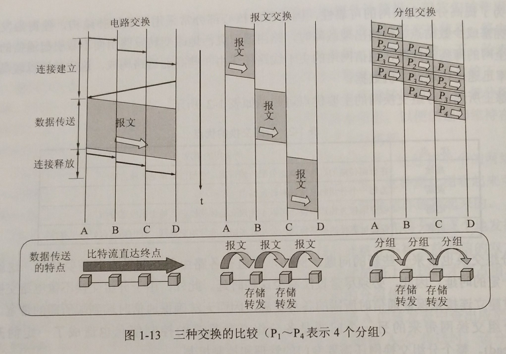

# 计算机网络
## 考试大纲
### 绪论
(1)计算机网络的概念、分类、标准、组成与功能
```
    概念/定义：一些相互连接的、自治的计算机集合
    分类：
        1、按作用范围：广域网、城域网、局域网、个人区域网
        2、按网络的使用者：公用网、专用网
        3、用来把用户接入互联网的网络：AN/接入网
    标准：
        1、因特网草案 --- 非RFC
        2、建议标准  ---  RFC （下同）
        3、草案标准
        4、因特网标准
    组成：
        1、边缘部分：包含所有因特网主机，这部分是用户直接使用的，用来进行通信和资源共享
        客户---服务器  #即C/S，B/S是C/S的特例
        对等连接       P2P
        2、核心部分：由大量的网络和连接这些网络的路由器组成。这部分是为边缘部分提供服务的（提供连通性和交换）
            电路交换
            分组交换
            保温交换
    功能：
        1、信息交换/通信
        2、资源共享
        3、提高系统的可靠性
```
(2)计算机网络分层结构，协议、接口、服务等概念，ISO/OSI模型和TCP/IP模型
```
    分层结构：
             OSI           TCP/IP              五层协议
        7   应用层       | 　　　   |         | 　　　   |
        6   表示层       | 应用层   |       5 |  应用层　|
        5   会话层.......| 　　　   |         | 　　　   |
        4   运输层.......  运输层           4    运输层
        3   网络层.......  网际层           3    网络层
        2   数据链路层....|网络接口层|       2    数据链路层
        1   物理层     　 |         　      1    物理层
    实体：表示任何可以发送或接收信息的硬件或软件进程，大多数情况下，实体就是一个特定的软件模块
    协议：控制两个或多个对等实体进行通信的规则集合
    接口：
    服务：由下层向上层通过层间接口实现
    服务访问点：同一系统中相邻两层交换信息的地方
```
### 物理层
(1)通信信道、信号、宽带、码元、波特、速率、信源与信宿等基本概念，奈奎斯特定理与香农定理，编码与调制，电路交换、报文交换与分组交换，数据报与虚电路
```
基本概念
    通信信道：用来表示某一个方向传送信息的媒体
        A、单向通信            单工通信
        B、双向交替通信        半双工通信
        C、双向同时通信        全双工通信
    信号：数据的电气或电磁表现形式
    带宽：单位时间内的最大数据流量
    码元：使用二进制编码时，只有两种码元：0和1
    波特：单位时间内载波调制状态变化的次数
    速率：bps = bit per second
    信源：也称源站、源点；产生要传输的数据
    信宿：也称目的站、终点；从接收器获取传送来的数字比特流，然后把信息输出
  其他
    奈奎斯定理：码元的传输速率有上限，茶超过上限会出现严重的码间串扰现象，使接收端对码元的判决成为不可能
    香农定理：信道的极限传输速率C = Wlog2(1+S/N)(b/s)
             S/N 信号的平均功率与噪声的平均功率之比
    编码：
        不归零：正电平代表1，负电平代表0
        归零制：正脉冲代表1，负脉冲代表0
        曼彻斯特编码：中心位置向上跳变代表0，中心位置向下跳变代表1
        差分曼彻斯特编码：中心位置始终有跳变，边界位置有跳变代表0，没有跳变代表1
    调制：
        调幅：振幅随着基带数字信号变化，0、1分别对应于无载波或有载波
        调频：载波的频率随着基带数字信号变化，0、1分别对应于频率f0、f1
        调相：载波的初始相位随着基带数字信号变化，0、1分别对应于相位0度或180度
    电路交换：
    报文交换：
    分组交换：
    数据报与虚电路：
```


(2)双绞线、同轴电缆、光纤与无线传输介质，物理层接口的特性，中继器，集线器
```
    双绞线：
    同轴电缆:
    光纤：
    无线传输介质：
    物理层接口的特性：
    中继器：
    集线器：
```
### 数据链路层
(1)数据链路层的功能，组帧，差错控制(检错与纠错编码)
```

```
(2)流量控制、可靠传输与滑轮窗口机制，停止-等待协议，后退N帧协议(GBN)，选择重传协议(SR)
```

```
(3)频分多路复用、时分多路复用、波分多路复用、码分多路复用的概念和基本原理，ALOHA协议、CSMA协议、CSMA/CA协议、令牌传递协议
```

```
(4)局域网的概念及其体系结构，以太网与IEEE 802.3，IEEE802.11，令牌环网
```

```
(5)广域网的概念，PPP协议，HDLC协议
```

```
(6)网桥的概念和原理，交换机及其工作原理。
```

```
### 网络层
(1)网络层的功能，异构网络互联，路由与转发，拥塞控制
```

```
(2)路由算法，静态路由与动态路由，距离-向量路由算法，链路状态路由算法，层次路由
```

```
(3)IPv4分组，IPv4地址与NAT，子网划分与子网掩码、CIDR，ARP协议、DHCP协议与ICMP协议
```

```
(4)IPv6的主要特点，IPv6地址
```

```
(5)路由协议，自治系统，域内路由与域间路由，RIP路由协议、OSPF路由协议、BGP路由协议
```

```
(6)组播的概念，IP组播地址
```

```
(7)移动IP的概念，移动IP的通信过程
```

```
(8)路由器的组成和功能，路由表与路由转发
```

```
### 传输层
(1)传输层的功能，传输层寻址与端口，无连接服务与面向连接服务
```

```
(2)UDP协议，UDP数据报，UDP校验
```

```
(3)TCP协议，TCP段，TCP连接管理，TCP可靠传输，TCP流量控制与拥塞控制
```

```
### 应用层
(1)客户/服务器模型，P2P模型
```

```
(2)DNS概念，层次域名空间，域名服务器，域名解析过程
```

```
(3)FTP协议的工作原理，控制连接与数据连接
```

```
(4)电子邮件系统的组成结构，电子邮件格式与MIME，SMTP协议与POP3协议
```

```
(5)WWW的概念与组成结构，HTTP协议
```

```
## 考试要求
1. 掌握计算机网络的基本概念、基本原理和基本方法;
2. 掌握计算机网络的体系结构和典型网络协议，了解典型网络设备的组成和特点，理解典型网络设备的工作原理;
3. 能够运用计算机网络的基本概念、基本原理和基本方法进行网络系统的分析、设计和应用。

## 主要参考书目
1、计算机网络(第五版). [美] 特南鲍姆，[美] 韦瑟罗尔 著 严伟，潘爱民 译，北京：清华大学出版社，2012年。
2、计算机网络(第六版). 谢希仁编著，电子工业出版社，2013年。
编制单位：中国科学院大学
